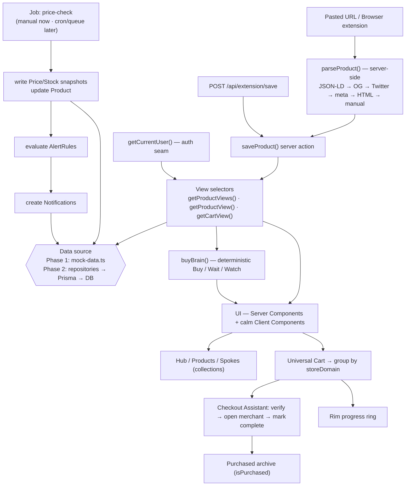

# UniKart — Architecture

UniKart is a calm "buying operating system": save what you want, understand when to
buy, and check out with less chaos. It is not a wishlist and not a deal site. This
document describes how the app is built, why the seams sit where they do, and how
each planned phase drops into place without rewrites.

The guiding principle is **one-file swaps**. Phase 1 runs entirely on typed mock
data. Every later phase (a real database, real auth, a real parser, real jobs)
replaces a single well-named module behind an interface the rest of the app already
depends on.

---

## High-level overview

| Concern | Phase 1 (now) | Later |
| --- | --- | --- |
| Framework | Next.js 16.2.9, App Router, React 19.2.4, TypeScript 5 | unchanged |
| Styling | Tailwind CSS v4, CSS-first `@theme` in `globals.css` | unchanged |
| Data | Typed mock selectors in `src/lib/mock-data.ts` | Prisma repositories |
| Database | none | SQLite locally, Postgres in production |
| Auth | mock single-user session via `getCurrentUser()` | Auth.js (NextAuth v5) |
| Parser | mock adapters returning canned metadata | server-side fetch + extractors |
| Jobs | manual "Run check now" action | cron / queue behind a `Job` interface |
| Charts | custom lightweight SVG price chart | Recharts optional |
| Deploy | Netlify + `@netlify/plugin-nextjs` | unchanged |

The stack is locked. The architecture exists so the locked stack can grow without
churn. Nothing below claims a shipped feature that is only planned; future work is
labelled.

---

## Folder structure

```
src/
  app/                          # App Router: routes, layouts, server actions
    layout.tsx                  # root layout, fonts, body background (porcelain)
    globals.css                 # Tailwind v4 @theme tokens (single source of truth)
    page.tsx                    # / — landing
    sign-in/page.tsx            # /sign-in
    demo/page.tsx               # /demo
    (app)/                      # route group: the signed-in app shell ("the Hub")
      layout.tsx                # shared chrome: nav, frosted header, the Rim ring
      dashboard/page.tsx        # /dashboard — the Hub
      products/[id]/page.tsx    # /products/[id]
      collections/page.tsx      # /collections — "Spokes"
      cart/page.tsx             # /cart
      cart/checkout-assistant/page.tsx   # /cart/checkout-assistant
      notifications/page.tsx    # /notifications
      settings/page.tsx         # /settings
    api/
      extension/save/route.ts   # public POST endpoint for the browser extension

  components/                   # by domain, not by widget type
    ui/                         # primitives: Button, Card, Ring, Hairline, Glass
    product/                    # ProductCard, SpokeIndicators, PriceChart, BuyBadge
    collection/                 # SpokeList, SpokeCard
    cart/                       # CartList, MerchantGroup, RimProgress
    checkout/                   # CheckoutStepRow, AssistantFlow
    notifications/              # NotificationItem, NotificationList
    layout/                     # Header, Nav, Footer (affiliate disclosure)

  lib/                          # framework-free domain logic and data access
    types.ts                    # domain types (mirror Prisma models) — exists
    mock-data.ts                # seed data + view selectors — exists
    utils.ts                    # cn(), formatters, small helpers — exists
    buy-brain.ts                # deterministic Buy / Wait / Watch — exists
    auth.ts                     # getCurrentUser() seam (mock now)        [planned]
    db.ts                       # Prisma client singleton                 [Phase 2]
    repositories/               # one module per aggregate                [Phase 2]
      products.ts
      collections.ts
      carts.ts
      notifications.ts
    parser/                     # product metadata extraction             [Phase 3]
      index.ts                  # parseProduct() orchestrator
      extractors/               # jsonLd, openGraph, twitter, meta, html, manual
      fetch.ts                  # respectful server-side fetch policy
      adapters/                 # per-store mock adapters / overrides
    jobs/                       # background work abstraction              [Phase 4]
      types.ts                  # Job interface
      runner.ts                 # manual runner now; cron/queue later
      price-check.ts            # snapshot writes + alert evaluation
```

Components are grouped by **domain** (product, cart, checkout) rather than by visual
type. This keeps a feature's surface area in one place and matches how the data
selectors are sliced. The `lib/` folder holds logic that has no dependency on React
or Next — it stays portable to future native apps that share the same API.

Files marked **exists** are in the current scaffold. Everything else is created in
the phase noted.

---

## Data layer strategy

The whole UI reads from a small set of **view selectors**. The UI never touches a
database, a fetch, or a raw model directly — it asks for a view and renders it.

### Phase 1 — mock selectors

`src/lib/mock-data.ts` holds seed records and exposes these selectors:

```ts
getProductViews(): ProductView[]          // list for the Hub / collections
getProductView(id: string): ProductView   // detail for /products/[id]
getCartView(): CartView                    // grouped cart for /cart + assistant
```

A `ProductView` (already defined in `types.ts`) is a `Product` enriched with the
data the UI actually needs together: its `collections`, `priceHistory`, the active
`alert`, and an `inCart` flag. The selector does the joining; the component does the
rendering. This is the seam.

```ts
// component code — identical in Phase 1 and Phase 2
const products = await getProductViews();
```

### Phase 2 — Prisma, one-file swap

Because every screen depends on the selector and not on the data source, swapping to
a real database is a single change inside `getProductViews()` /
`getProductView()` / `getCartView()`: replace the mock array reads with repository
calls. No component changes, no route changes.

- `src/lib/db.ts` exports a single Prisma client (singleton, dev-safe against
  hot-reload).
- `src/lib/repositories/*` implement the **repository pattern** — one module per
  aggregate (`products`, `collections`, `carts`, `notifications`), each returning
  domain types from `types.ts`. Repositories are the only code that imports Prisma.
- The selectors compose repositories into views.

```
UI  →  getProductView()  →  repositories/products.ts  →  Prisma  →  DB
                         ↘  repositories/collections.ts ↗
```

### SQLite now, Postgres later

The Prisma `schema.prisma` uses `provider = "sqlite"` for zero-friction local
development. Production moves to Postgres by changing two things only:

1. the datasource `provider` to `postgresql`,
2. the `DATABASE_URL` environment variable.

The repository layer hides any dialect differences from the rest of the app, so the
provider swap stays contained. The domain types in `types.ts` are written to mirror
the planned Prisma models 1:1, so the Phase 1 UI maps directly onto Phase 2 rows.

---

## Auth abstraction

Auth is a single seam: `getCurrentUser()` in `src/lib/auth.ts`.

```ts
// Phase 1
export async function getCurrentUser(): Promise<User> {
  return MOCK_USER; // single-user session
}
```

Every server action and page that needs identity calls `getCurrentUser()`. Nothing
else knows how identity is resolved.

When Auth.js (NextAuth v5) is introduced, only `auth.ts` changes: `getCurrentUser()`
reads the real session and returns the same `User` shape. Routes, actions, and
repositories are untouched. Unauthenticated access redirects to `/sign-in`. Until
then `/sign-in` is a calm placeholder that enters the demo single-user session.

---

## Product parser service design

The parser turns a pasted URL into structured product metadata. It runs
**server-side only** (so the browser never makes cross-origin store requests, and so
secrets and fetch policy stay on the server).

### Ordered extractors

`parseProduct(url)` runs extractors in priority order and stops when it has enough:

1. **JSON-LD** `schema.org/Product`
2. **Open Graph** tags
3. **Twitter card** tags
4. common **ecommerce meta tags**
5. **HTML title / image** fallback
6. **manual entry** fallback

### Output

A single normalized record:

```
title, description, imageUrl, price, currency, availability,
brand, sku, canonicalUrl, storeDomain, confidence, rawMetadata
```

### Confidence scoring

`confidence` is `high | medium | low`, derived from which extractor succeeded and how
complete the fields are: structured JSON-LD with a price is `high`; an Open Graph or
meta-tag result is `medium`; a title/image guess or manual entry is `low`. The value
is stored on the product as `metadataConfidence` and surfaced subtly in the UI so the
user always knows how trustworthy a saved item is. `rawMetadata` keeps the original
payload for later re-parsing without re-fetching.

### Respectful fetch policy (`parser/fetch.ts`)

A hard constraint, not a nicety:

- Identify with an honest user agent; respect timeouts and sane size limits.
- One respectful fetch per parse; no aggressive or repeated scraping.
- **Do not** bypass anti-bot systems.
- **Never** ask for or store store credentials.
- **Never** store payment cards.

### Mock fallback (`parser/adapters/`)

Where a real page blocks fetching or returns nothing useful, a per-store **mock
adapter** supplies canned, clearly-marked metadata so the product flow stays usable
and demoable. Adapters are also the place for store-specific quirks later. In Phase 1
the parser is entirely mock adapters; the real fetch + extractor pipeline lands in
Phase 3.

---

## Price / stock tracking and the job abstraction

Tracking is a pipeline: check a product, write snapshots, evaluate alerts, create
notifications.

```
run check
   │
   ▼
fetch latest (parser)            // mock in Phase 1
   │
   ▼
write PriceSnapshot + StockSnapshot   // source: scheduled | manual
   │
   ▼
update Product (currentPrice, previousPrice, lowest/highest, availability, lastCheckedAt)
   │
   ▼
evaluate AlertRules (price_drop, target_price, back_in_stock, …)
   │
   ▼
create Notification(s) when a rule fires
```

### Job interface

Background work hides behind a small interface so the trigger mechanism can change
without touching the work itself.

```ts
export interface Job<Result = void> {
  name: string;
  run(ctx: JobContext): Promise<Result>;
}
```

- **Phase 1 / MVP:** there is no cron. A `runner.ts` executes jobs **on demand** via
  a "Run check now" action in the UI (a server action). The `price-check` job uses
  mock data to simulate movement so alerts and notifications are demonstrable.
- **Later:** the same `Job` objects are invoked by a real scheduler — a cron trigger
  or a queue worker — with no change to the job bodies. Snapshot writes go through the
  repositories, so persistence is already real once Phase 2 lands.

This keeps "what the job does" separate from "when and how it runs."

---

## Universal Cart and Checkout Assistant flow

The Universal Cart collects saved products across stores into one place. The
**Checkout Assistant** helps the user actually buy them, calmly and in sequence.

> The MVP does **not** perform one-tap cross-retailer purchase. It guides; it does
> not transact. There is no real payment processing.

Flow:

1. **Group by merchant.** `getCartView()` groups `UniversalCartItem`s by
   `storeDomain` into `CheckoutStep`s, one per merchant, each with an estimated
   subtotal.
2. **Verify.** Before checkout, the assistant verifies the latest known price and
   stock for each item (via the same tracking pipeline), so the user isn't surprised.
3. **Sequence.** For each merchant step, the assistant opens that merchant's
   checkout or product page. The user completes the purchase **on the merchant's own
   site**.
4. **Mark complete.** The user marks each step done. Completed items move to the
   **Purchased archive** (`isPurchased = true`).
5. **The Rim.** Progress is shown as a wheel-rim ring — the share of cart value or
   steps completed. It is the cart's progress indicator, not a payment status.

```
UniversalCart
  └─ items grouped by storeDomain
       ├─ CheckoutStep (store A)  → open → user buys → mark complete → archive
       ├─ CheckoutStep (store B)  → …
       └─ CheckoutStep (store C)  → …
              progress ──────────────► Rim ring
```

---

## Integration adapter interface

Future checkout and commerce integrations sit behind one shape, `IntegrationAdapter`
(in `types.ts`), with a `type` of `merchant | payment | bnpl | agentic | affiliate`
and a `status` of `live | planned | beta`.

In the MVP these are **placeholders only**. There are **no real partnerships**, no
real payment processing, and **no BNPL brand logos** — BNPL is text only. Planned
adapter slots:

| Adapter | Type | Status | Notes |
| --- | --- | --- | --- |
| Shopify checkout | merchant | planned | open a `checkoutUrl` for a merchant step |
| Stripe saved payment | payment | planned | future saved-payment convenience |
| BNPL partner | bnpl | planned | text-only placeholder, no logos, no partner |
| ACP / agentic commerce | agentic | planned | future agent-assisted checkout |
| Affiliate | affiliate | planned | optional, clearly disclosed |

Adapters declare capability and status; the cart/checkout code reads `status` and
only ever exposes what is genuinely available. Anything not `live` renders as a clear
"coming later" affordance.

---

## API surface

UniKart prefers **server actions** for in-app mutations and exposes exactly one
public HTTP endpoint for the browser extension.

### Server actions (in-app)

Co-located with the routes that use them. They call `getCurrentUser()`, then the
selectors / repositories, then return updated views. Examples:

| Action | Purpose |
| --- | --- |
| `saveProduct(url)` | parse a URL and save a product |
| `addToCart(productId)` / `removeFromCart(itemId)` | cart membership |
| `setAlert(productId, rule)` | create or update an `AlertRule` |
| `runCheckNow(productId?)` | trigger the price/stock job manually |
| `completeCheckoutStep(stepId)` | mark a merchant step done, archive items |
| `markNotificationRead(id)` | notification state |
| `exportData()` / `deleteAccount()` | privacy controls |

### Public endpoint (browser extension)

```
POST /api/extension/save
```

A single, public, CORS-aware JSON endpoint so the future browser extension can save
the page the user is viewing. It accepts a URL (plus any metadata the extension
already scraped client-side), runs the same `saveProduct` path on the server, and
returns the created `ProductView`. It is the only externally callable surface; it is
authenticated the same way as the rest of the app once Auth.js lands, and it stores
no credentials or payment data.

---

## Rendering conventions

- **Server Components by default.** Pages and data-reading components are Server
  Components; they call selectors directly and stream HTML.
- **Client Components only where needed** — interaction, animation, local state.
  Marked with `"use client"` and kept small (a card's hover, the Rim ring, the
  assistant stepper).
- **Server actions for mutations**, not client-side fetch waterfalls.
- **Tokens, not hardcoded values.** All color, radius, shadow, font, and motion
  values come from the `@theme` block in `globals.css`. Components use the token
  utilities (e.g. surfaces porcelain `#fbfbfd`, ink `#1d1d1f`, accent `#0071e3`).
- **Motion is calm and optional.** framer-motion microinteractions use the
  `ease-out-soft` curve `cubic-bezier(.22,1,.36,1)`; the thin-line **wheel loader**
  spins while a URL is parsed. Everything respects `prefers-reduced-motion`.
- **Brand details stay subtle.** "Spoke" indicators are tiny radial marks for price
  movement, stock, and alert status; the "Rim" is the cart progress ring. Thin lines,
  frosted glass, low-contrast layered shadows — no ecommerce hype.

---

## Testing strategy

The seams are also the test boundaries.

- **Domain logic (unit).** `buy-brain.ts` is pure and deterministic — the highest-
  value tests live here (target reached, near lowest, below/above average,
  volatility, out-of-stock). Parser extractors and confidence scoring are tested
  against fixed HTML fixtures. The job's alert-evaluation logic is tested against
  snapshot inputs.
- **Selectors / repositories (integration).** Test `getProductView()` and
  `getCartView()` against seed data (mock in Phase 1, a test SQLite database in
  Phase 2) so view shape stays stable across the swap.
- **Components.** Render product cards, the Rim ring, and the assistant stepper with
  fixed view models; assert the calm states (price up/down/steady, in/low/out of
  stock, confidence levels).
- **Parser fetch.** Always mocked — never hit live stores in tests; respect the same
  no-scraping policy the runtime enforces.
- **End-to-end (light).** A happy path over the core flow: save a product → see it on
  the Hub → add to cart → run the Checkout Assistant → item lands in the Purchased
  archive.

Because logic lives in framework-free `lib/`, most tests need no Next.js runtime.

---

## Deployment

Target is **Netlify** on the developer's personal account.

- Deploy with **`@netlify/plugin-nextjs`**, which adapts the App Router (server
  components, server actions, and the `/api/extension/save` route) to Netlify's
  build and runtime.
- **Build:** `npm run build`. **Local dev:** `npm run dev`.
- **Environment.** Phase 1 needs no secrets. Phase 2 introduces `DATABASE_URL`
  (set in Netlify environment variables) and, with Auth.js, the relevant auth
  secrets. Local development uses SQLite; production uses Postgres via that same
  `DATABASE_URL`.
- **PWA metadata** is included for a future installable mobile experience; native
  apps later consume the same server API.
- **Git identity.** This is a personal project. The machine's global git is currently
  a **work** email — set a **personal** git identity for this repository before
  committing and pushing to the developer's own GitHub. (See `README.md` for the
  exact setup and deploy steps.)

---

## Data-flow diagram



Plain-language version of the same flow:

```
URL or extension  ─►  parser (server-side, ordered extractors, confidence)
                          │
                  saveProduct() ──────────────┐
                          │                    │
   getCurrentUser() ─►  view selectors  ─►  data source (mock → Prisma/DB)
                          │
                          ├─►  Buy Brain (Buy / Wait / Watch)
                          └─►  UI: Hub · Products · Spokes · Cart
                                          │
                Universal Cart ─► group by merchant ─► Checkout Assistant
                                          │                     │
                                     Rim ring            Purchased archive

   Job (manual now, cron later) ─► snapshots ─► alert rules ─► notifications
```

---

### A note on trust

Shopping data is sensitive, so UniKart is built around trust: privacy-first controls
(export data, delete account, delete a product's history), affiliate disclosure-ready
copy in Settings and the footer, clear "may earn commission in future" language, **no
fake partnerships, no real payment processing in the MVP, and no invasive scraping.**
The architecture above keeps every one of those promises enforceable in one place.
